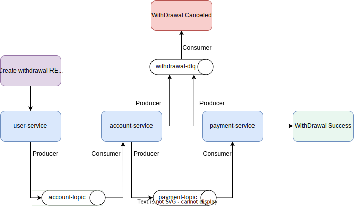

## PubSub Mechanism

A simple Example of an Event Driven Flow by the help of **SPRING CLOUD STREAM KAFKA**

##### properties

* java.version: `11`
* spring-cloud.version: `3.2.2`
* spring-boot.version: `2.6.7`


* `

## How to run Application

Running application from command line using Docker, this is the cleanest way.
In order for this approach to work, of course, you need to have Docker installed in your local environment.

* From the root directory you can run the following command:<br/>
  ```docker-compose -f docker/docker-compose.yml up --build```
* Application will be running on: http://localhost:8082
* To stop it you can open other terminal in the same directory, and then run the following command:<br/>
  ```docker-compose -f docker/docker-compose.yml down```